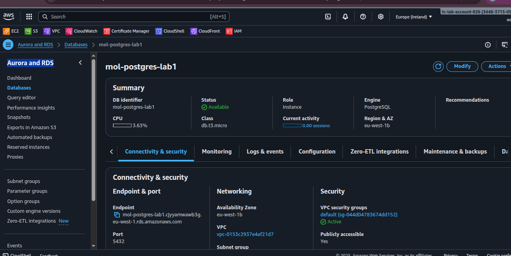

# Lab 1 – MySQL and PostgreSQL on AWS RDS

This lab demonstrates the setup and testing of **MySQL** and **PostgreSQL** databases on AWS RDS.  
The work includes provisioning instances, configuring security groups, testing connections, and estimating costs.  

---

## 📌 Steps Completed

1. **Created MySQL RDS instance**  
   - Instance class: `db.t3.micro`  
   - Storage: 20 GB gp2  
   - Public access enabled  
   - Initial DB: `labdb`  

2. **Created PostgreSQL RDS instance**  
   - Instance class: `db.t3.micro`  
   - Storage: 20 GB gp2  
   - Public access enabled  
   - Initial DB: `labdb`  

3. **Configured Security Groups**  
   - MySQL (3306) and PostgreSQL (5432) open to my IP.  

4. **Tested connections**  
   - Successfully connected using `mysql` and `psql` clients.  
   - Verified with simple table creation and data insertion.  

---

## 📷 Screenshots

### ✅ RDS Instances – Available Status
  
  

### ✅ Successful Database Connections
  
  

*(Replace the filenames above with your actual screenshot names — make sure they’re inside a `screenshots/` folder)*

---

## 💰 Cost Estimation (24 Hours)

For **db.t3.micro** in `eu-west-1` with 20 GB storage:

| Resource             | MySQL | PostgreSQL | Total |
|----------------------|-------|------------|-------|
| Instance cost        | $0.41 | $0.41      | $0.82 |
| Storage (20 GB)      | $0.08 | $0.08      | $0.16 |
| **Total per 24 hrs** | $0.49 | $0.49      | **≈ $0.98** |

⚠️ Note: If Free Tier is still active, costs may be **$0**.  

---

## 📖 Assessment Answers

**Q1. Key differences between MySQL and PostgreSQL setup**  
- Different default users (`admin` vs. `postgres`).  
- Different connection tools (`mysql` vs. `psql`).  
- PostgreSQL required stricter network/security configuration.  

**Q2. How long did it take for each instance to become available?**  
- MySQL: ~5–7 minutes  
- PostgreSQL: ~7–10 minutes  

**Q3. What happens if a larger instance class is chosen?**  
- Better performance (more CPU/memory).  
- Higher cost.  
- Same configuration process, only resource allocation changes.  

---

