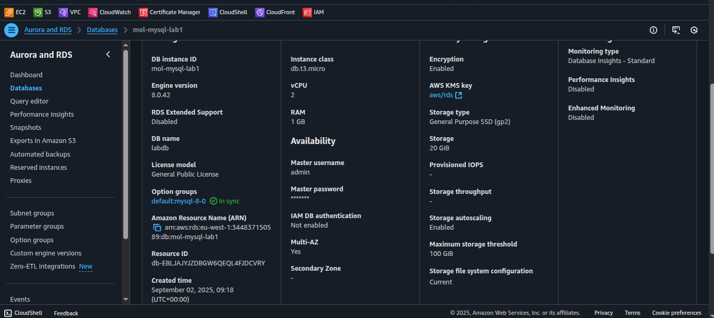

# Lab 2: Multi-AZ Deployment and Failover Testing

## Objective
Configure Multi-AZ deployment, understand failover behavior, and test high availability features.

---

## Compare: Single-AZ vs Multi-AZ Availability Impact

### Single-AZ Deployment
- **Availability:** Limited to a single Availability Zone (AZ).  
- **Risk:** If the AZ goes down due to failure or maintenance, the database becomes unavailable.  
- **Cost:** Lower (only one instance is running).  

### Multi-AZ Deployment
- **Availability:** High availability with automatic failover to a standby instance in a different AZ.  
- **Failover:** Automatic failover typically takes 1–2 minutes.  
- **Connection String:** Remains the same before and after failover.  
- **Cost:** Approximately 2× the cost of a Single-AZ deployment since AWS maintains a standby instance.  

---

## Deliverables

1. **Screenshot: Multi-AZ enabled status**  
   

2. **Before/after screenshots of Primary AZ configuration**  
   - Before:   
   - After: 

---

## Notes
- Multi-AZ ensures **automatic high availability** without requiring manual intervention.  
- Applications do not need to update connection strings during failover.  
- While cost increases, this setup provides **resilience against AZ-level failures**.
