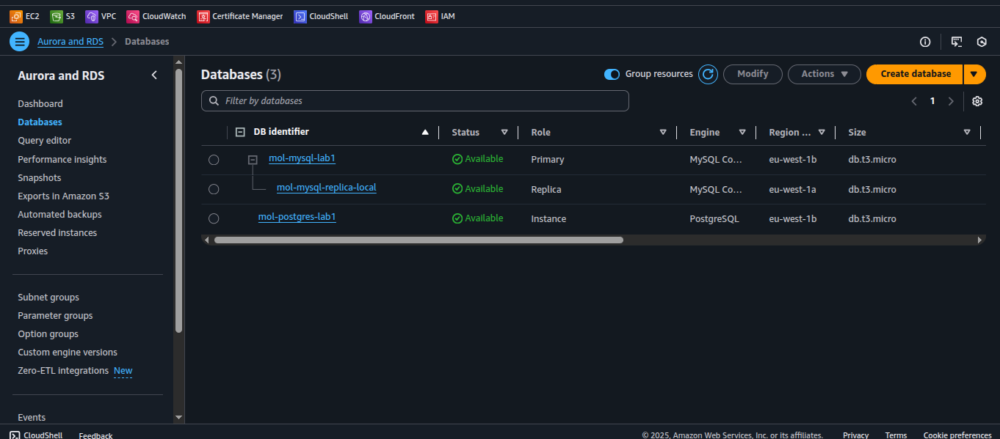
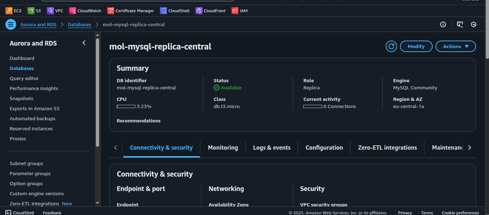
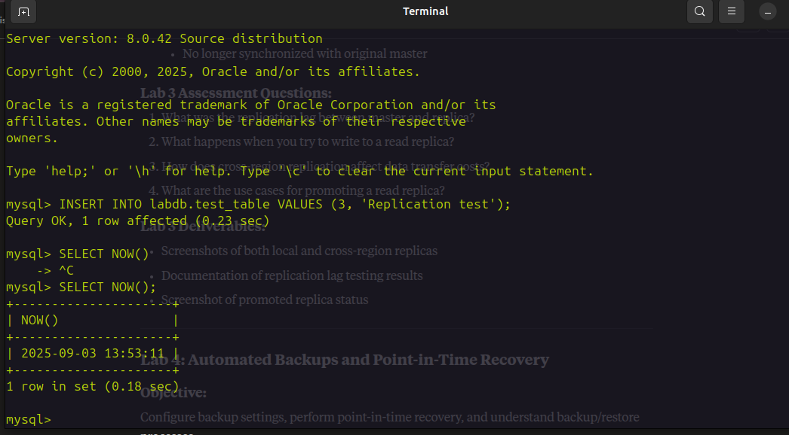
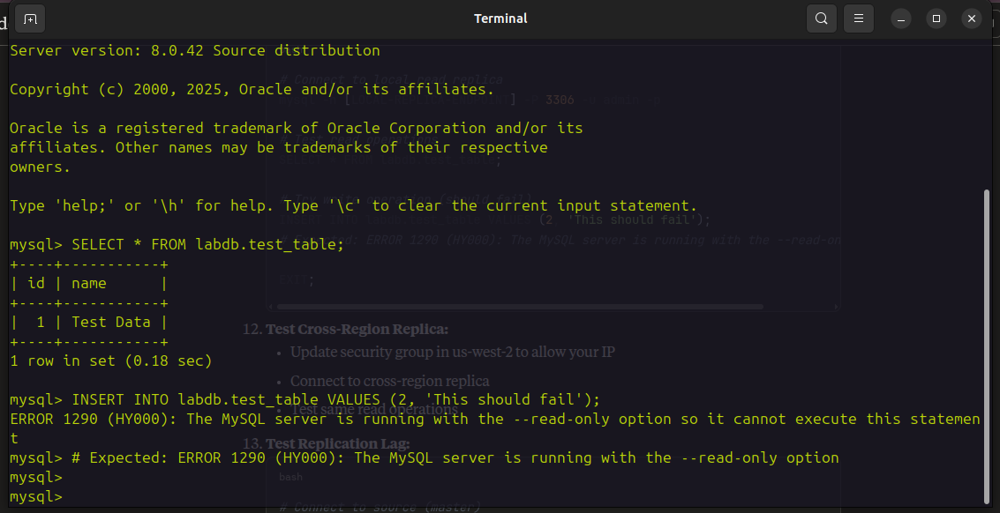
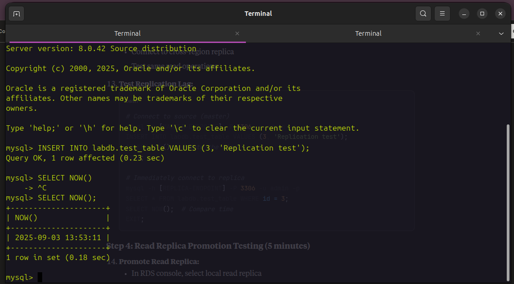
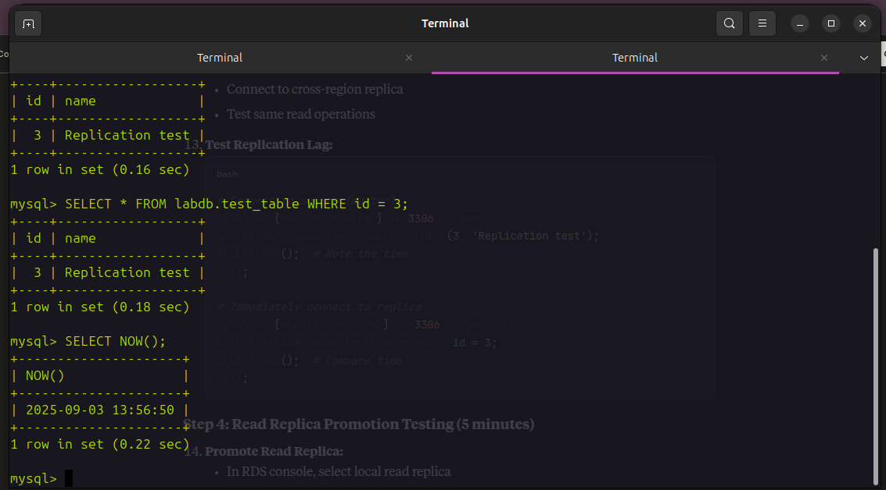
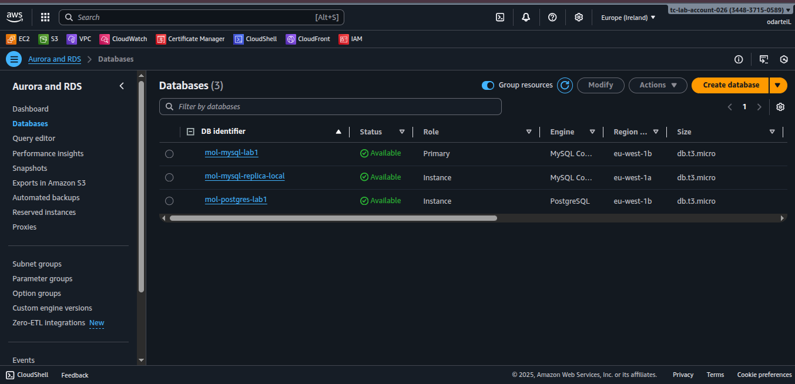

# Lab 3: Read Replicas and Performance Scaling

## Objective
Create read replicas, test read scaling, and understand cross-region replication capabilities.

**Duration:** 50 minutes

## Step 1: Create Read Replica in Same Region (20 minutes)

### Create Local Read Replica
1. Select your MySQL instance (ensure it's Multi-AZ enabled)
2. Actions → "Create read replica"

### Read Replica Settings
- **DB instance identifier:** [YOUR-INITIALS]-mysql-replica-local
- **Destination region:** Same as source
- **Destination AZ:** Different from source (if Multi-AZ source)
- **Instance class:** db.t3.micro

### Network & Security
- **VPC:** Same as source
- **Subnet group:** Same as source
- **Public accessibility:** Yes
- **VPC security groups:** Same as source

### Database Options
- **Database port:** 3306
- **Parameter group:** default
- **Option group:** default
- **Enhanced monitoring:** No
- **Performance Insights:** No

### Backup & Maintenance
- **Copy tags from source:** Yes
- **Enable encryption:** No
- **Backup retention:** 0 days
- **Auto minor version upgrade:** Yes

**Result:** Local read replica created successfully



## Step 2: Create Cross-Region Read Replica (15 minutes)

### Cross-Region Configuration
- **DB instance identifier:** [YOUR-INITIALS]-mysql-replica-west
- **Destination region:** US West (Oregon) - us-west-2
- **Instance class:** db.t3.micro

### Network Settings
- **VPC:** Default VPC (in us-west-2)
- **Public accessibility:** Yes
- **Create new security group** in us-west-2

**Result:** Cross-region replica created in us-west-2



## Step 3: Test Read Replica Functionality (10 minutes)

### Test Local Read Replica
```bash
# Connect to local read replica
mysql -h [LOCAL-REPLICA-ENDPOINT] -P 3306 -u admin -p

# Test read operations
SELECT * FROM labdb.test_table;

# Try write operation (should fail)
INSERT INTO labdb.test_table VALUES (2, 'This should fail');
# Expected: ERROR 1290 (HY000): The MySQL server is running with the --read-only option
```

### Master Database Connection


### Cross-Region Replica Connection


### Test Replication Lag
```bash
# Connect to source (master)
mysql -h [MASTER-ENDPOINT] -P 3306 -u admin -p
INSERT INTO labdb.test_table VALUES (3, 'Replication test');
SELECT NOW();  # Note the time
EXIT;

# Immediately connect to replica
mysql -h [REPLICA-ENDPOINT] -P 3306 -u admin -p
SELECT * FROM labdb.test_table WHERE id = 3;
SELECT NOW();  # Compare time
EXIT;
```

### Replication Testing Results



## Step 4: Read Replica Promotion Testing (5 minutes)

### Promote Read Replica
1. In RDS console, select local read replica
2. Actions → "Promote read replica"
3. This breaks replication and makes it independent
4. **Warning:** This is irreversible!

### Verify Promotion
- After promotion, replica becomes independent RDS instance
- Can now accept write operations
- No longer synchronized with original master



## Lab 3 Assessment Questions

1. **What was the replication lag between master and replica?**
2. **What happens when you try to write to a read replica?**
3. **How does cross-region replication affect data transfer costs?**
4. **What are the use cases for promoting a read replica?**

## Lab 3 Deliverables

✅ Screenshots of both local and cross-region replicas  
✅ Documentation of replication lag testing results  
✅ Screenshot of promoted replica status  

## Key Learnings

- Read replicas provide horizontal scaling for read-heavy workloads
- Cross-region replicas enable disaster recovery and global read scaling
- Read replicas are read-only until promoted
- Promotion breaks replication permanently
- Replication lag varies based on network latency and workload
