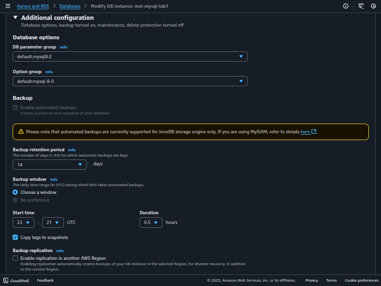
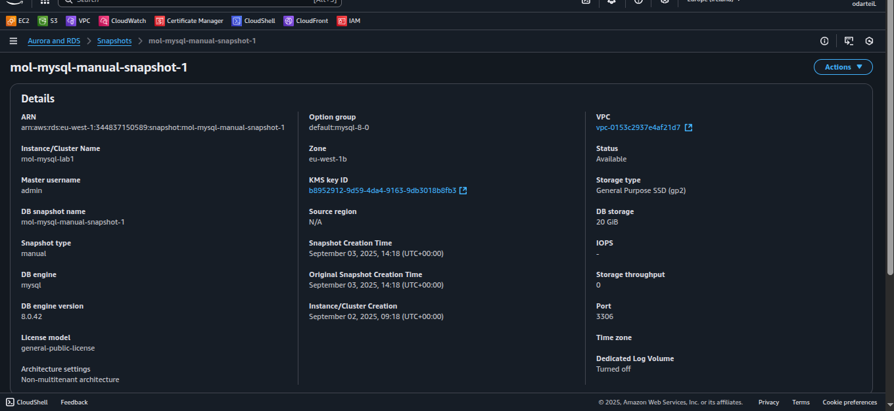
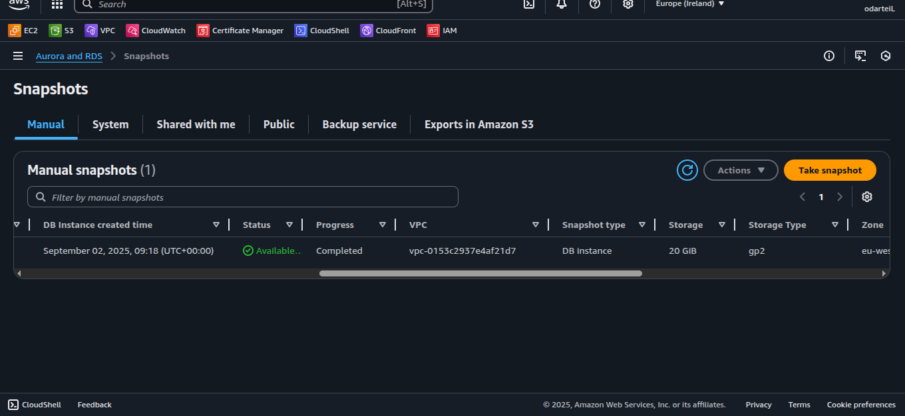
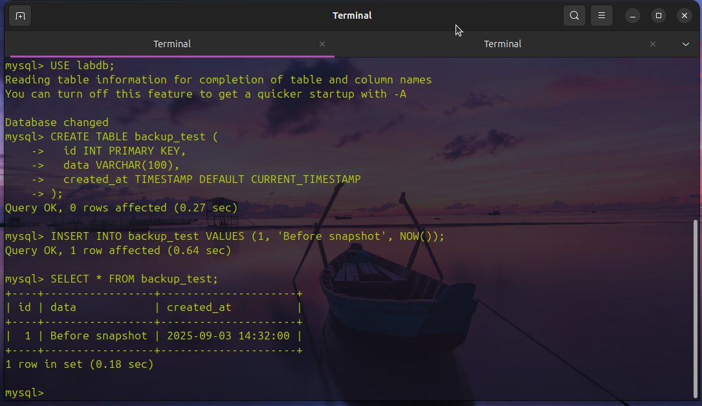
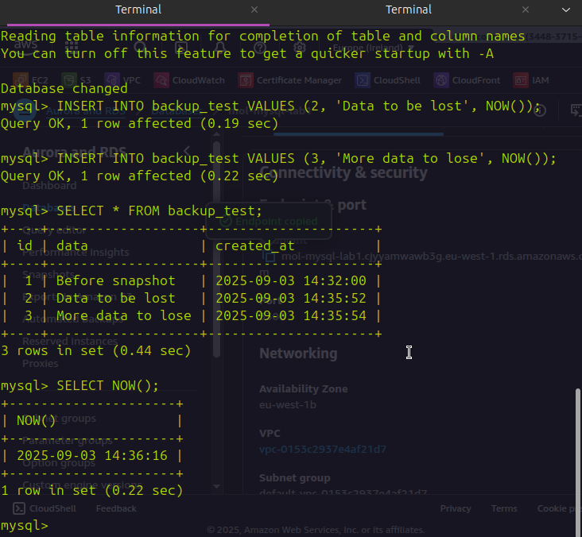
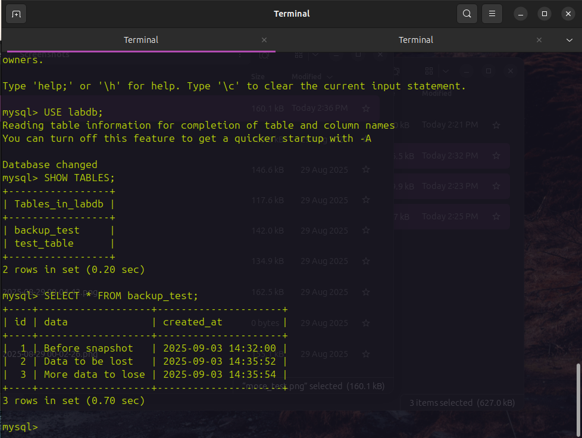

# Lab 4: Automated Backups and Point-in-Time Recovery

Configure backup settings, perform point-in-time recovery, and understand backup/restore processes.

**Duration:** 40 minutes

## Objectives

- Configure automated backup settings for RDS instances
- Create manual snapshots and understand backup storage
- Perform point-in-time recovery to restore lost data
- Compare backup methods and recovery capabilities

## Lab Steps Completed

### Step 1: Configure Backup Settings (10 minutes)
- Modified MySQL instance backup configuration
- Set backup retention period to 14 days
- Configured backup window (03:00-04:00 UTC)
- Enabled copy tags to snapshots

### Step 2: Create Manual Snapshot (10 minutes)
- Created manual snapshot: `[YOUR-INITIALS]-mysql-manual-snapshot-1`
- Created test data in `backup_test` table
- Monitored snapshot creation process

### Step 3: Simulate Data Loss and Recovery (15 minutes)
- Added additional test data
- Simulated accidental table deletion
- Performed point-in-time recovery to new instance: `[YOUR-INITIALS]-mysql-restored`

### Step 4: Verify Recovery (5 minutes)
- Verified data restoration in new instance
- Compared original vs restored instances

## Assessment Questions

1. **How does backup retention period affect storage costs?**
   - Longer retention = higher storage costs
   - Automated backups stored in AWS-managed S3
   - Manual snapshots persist until manually deleted

2. **What's the difference between manual snapshots and automated backups?**
   - Automated: Daily, retention-based, point-in-time recovery
   - Manual: On-demand, persist indefinitely, full restore only

3. **How long did the point-in-time recovery process take?**
   - Typically 10-20 minutes depending on instance size
   - Creates entirely new RDS instance

4. **What are the limitations of point-in-time recovery?**
   - Only available within retention period
   - Creates new instance (not in-place restore)
   - Requires transaction logs to be available
